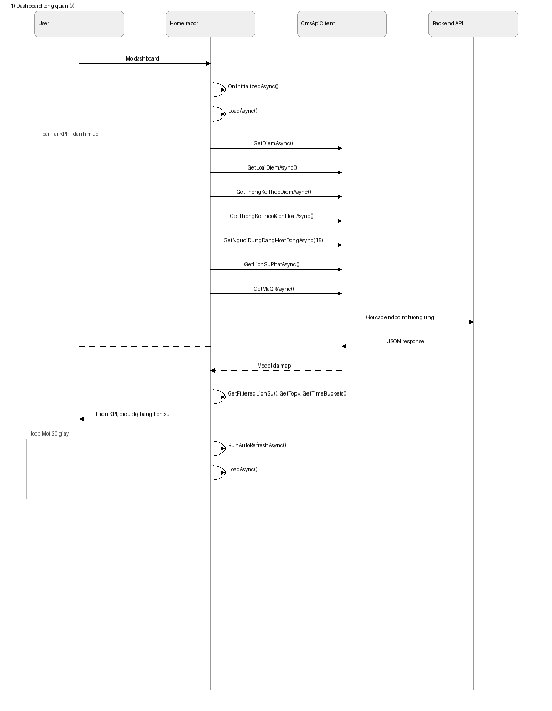
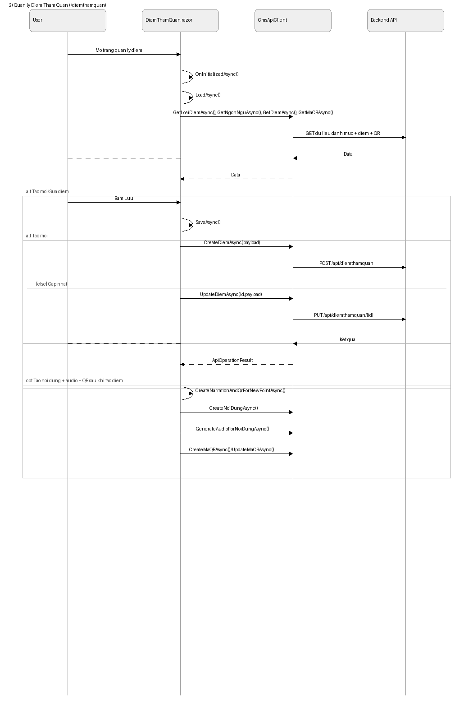
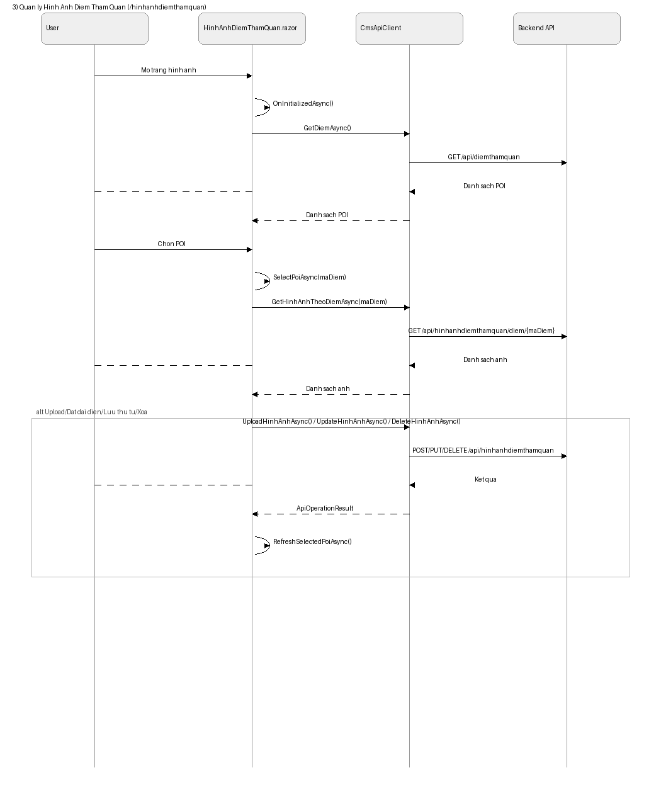
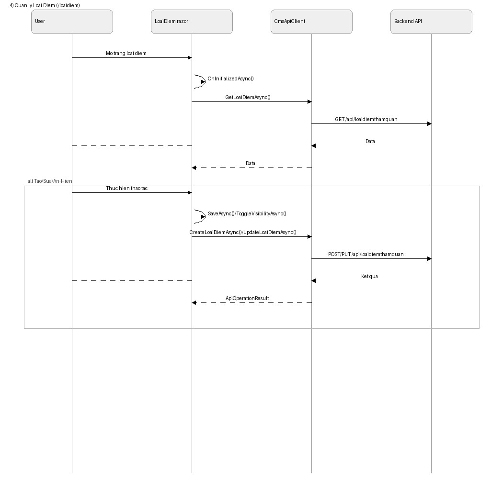
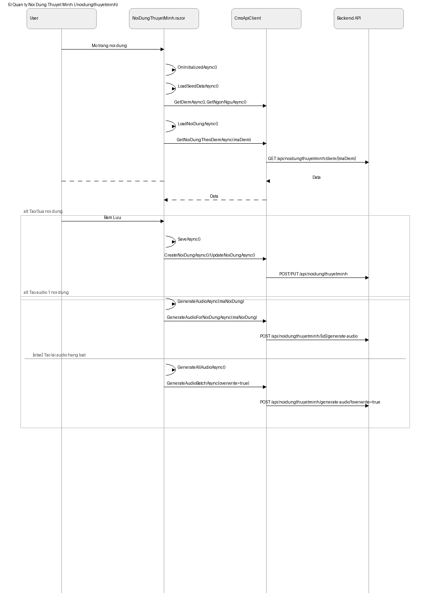
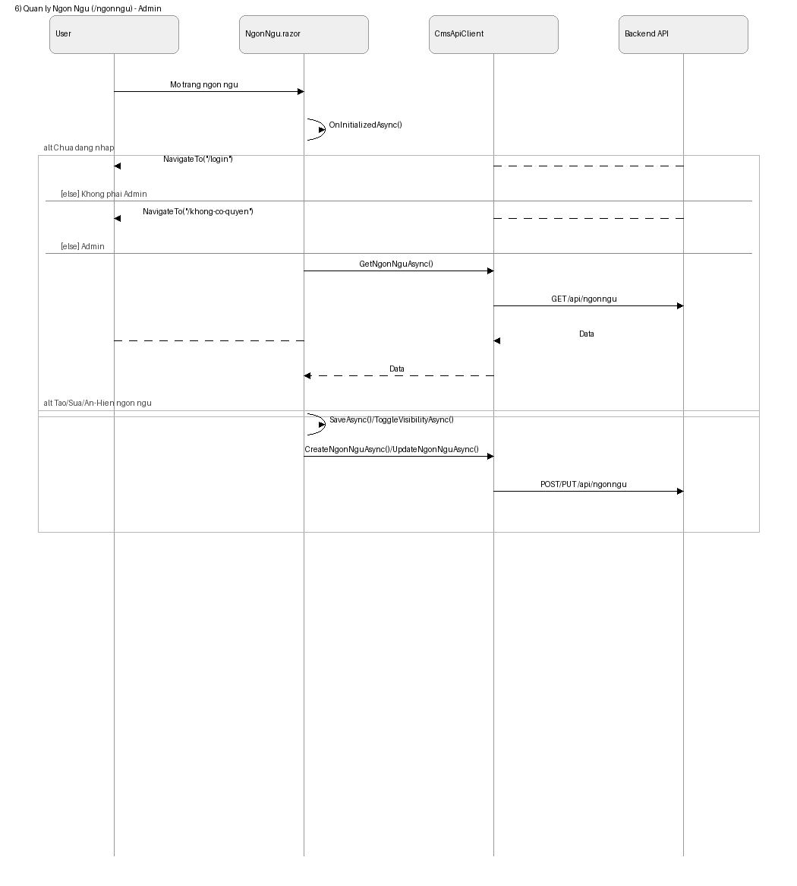
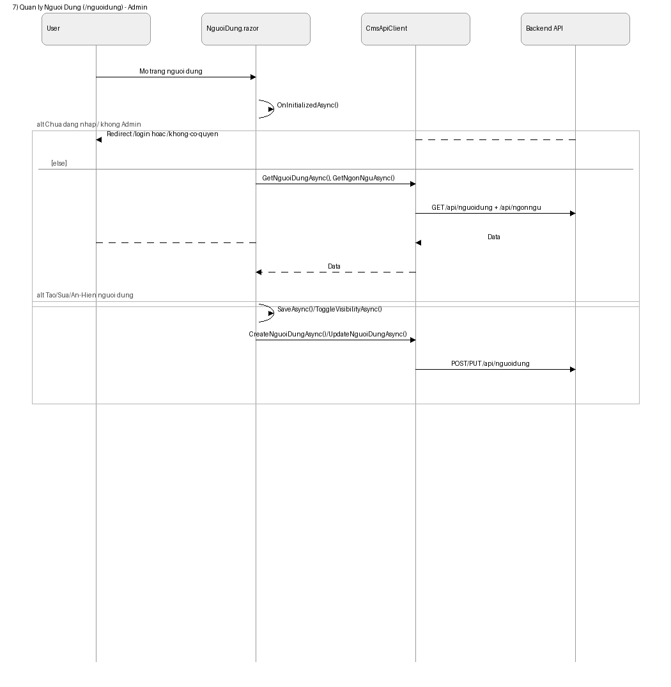
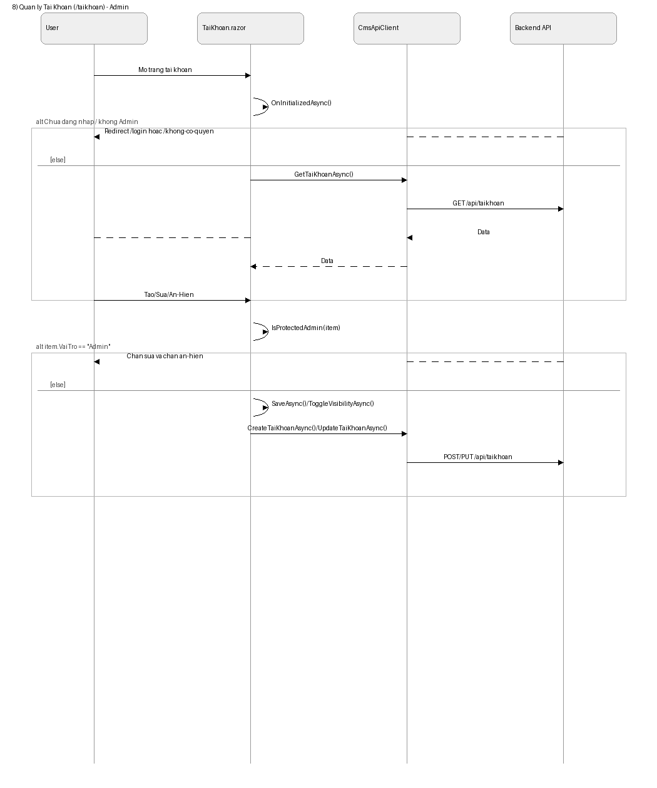

# Chuc nang CMS + Sequence + Hardcode

Tai lieu gom 8 chuc nang chinh cua CMS. Moi chuc nang co:
- 1 block sequence Mermaid theo mau giong hinh (actor User, participant, alt/loop)
- Danh sach ham chinh
- Vi tri hardcode lien quan

---

## 1) Dashboard tong quan (/)
### Sequence (mau)

### Ham chinh
- `Home.razor`: `OnInitializedAsync`, `LoadAsync`, `RunAutoRefreshAsync`, `GetFilteredLichSu`, `GetTopPoiRows`, `GetTopNguoiDungRows`, `GetTopNoiDungRows`, `GetTimeBuckets`, `GetActivationRows`, `GetDurationBands`.
- `CmsApiClient`: `GetThongKeTheoDiemAsync`, `GetThongKeTheoKichHoatAsync`, `GetNguoiDungDangHoatDongAsync`, `GetLichSuPhatAsync`, `GetMaQRAsync`.

### Hardcode
- `Home.razor:595` - `LongSessionThresholdSeconds = 120`.
- `Home.razor:596` - `AutoRefreshSeconds = 20`.
- `Home.razor:647` - online window hardcode `GetNguoiDungDangHoatDongAsync(15)`.

---

## 2) Quan ly Diem Tham Quan (/diemthamquan)
### Sequence (mau)

### Ham chinh
- `DiemThamQuan.razor`: `LoadAsync`, `SaveAsync`, `StartEditAsync`, `ToggleVisibilityAsync`, `UploadSelectedImagesAsync`, `SetRepresentativeImageAsync`, `DeleteImageAsync`, `CreateNarrationAndQrForNewPointAsync`, `BuildDefaultQrValue`.
- `CmsApiClient`: `CreateDiemAsync`, `UpdateDiemAsync`, `GetDiemAsync`, `GetMaQRAsync`, `CreateNoiDungAsync`, `GenerateAudioForNoiDungAsync`, `CreateMaQRAsync`, `UpdateMaQRAsync`, `UploadHinhAnhAsync`, `UpdateHinhAnhAsync`, `DeleteHinhAnhAsync`.

### Hardcode
- `DiemThamQuan.razor:748` - su dung dich vu ngoai `https://api.qrserver.com/...` de render QR.
- `DiemThamQuan.razor:782` - `imageVersion = "v20260417-poi"`.
- `DiemThamQuan.razor:771`, `:792` - fallback `Api:BaseUrl` -> `http://localhost:5000/`.
- `DiemThamQuan.razor:861` - QR default format `QR_{MaDinhDanh}`.

---

## 3) Quan ly Hinh Anh Diem Tham Quan (/hinhanhdiemthamquan)
### Sequence (mau)

### Ham chinh
- `HinhAnhDiemThamQuan.razor`: `LoadPoisAsync`, `SelectPoiAsync`, `LoadImagesAsync`, `UploadSelectedImagesAsync`, `SaveImageOrderAsync`, `SetRepresentativeImageAsync`, `DeleteImageAsync`, `RefreshSelectedPoiAsync`, `ResolveImageUrl`.
- `CmsApiClient`: `GetHinhAnhTheoDiemAsync`, `UploadHinhAnhAsync`, `UpdateHinhAnhAsync`, `DeleteHinhAnhAsync`.

### Hardcode
- `HinhAnhDiemThamQuan.razor:377` - `imageVersion = "v20260417-poi"`.
- `HinhAnhDiemThamQuan.razor:387` - fallback base URL `http://localhost:5000/`.
- `CmsApiClient.UploadHinhAnhAsync(...)` - mime hardcoded `application/octet-stream`.

---

## 4) Quan ly Loai Diem (/loaidiem)
### Sequence (mau)

### Ham chinh
- `LoaiDiem.razor`: `LoadAsync`, `SaveAsync`, `ToggleVisibilityAsync`, `StartEdit`, `FilteredItems`.
- `CmsApiClient`: `GetLoaiDiemAsync`, `CreateLoaiDiemAsync`, `UpdateLoaiDiemAsync`.

### Hardcode
- Endpoint string hardcoded trong service: `CmsApiClient` -> `"api/loaidiemthamquan"`.

---

## 5) Quan ly Noi Dung Thuyet Minh (/noidungthuyetminh)
### Sequence (mau)

### Ham chinh
- `NoiDungThuyetMinh.razor`: `LoadSeedDataAsync`, `LoadNoiDungAsync`, `SaveAsync`, `GenerateAudioAsync`, `GenerateAllAudioAsync`, `BuildCoverageRow`.
- `CmsApiClient`: `GetNoiDungTheoDiemAsync`, `CreateNoiDungAsync`, `UpdateNoiDungAsync`, `GenerateAudioForNoiDungAsync`, `GenerateAudioBatchAsync`.

### Hardcode
- `NoiDungThuyetMinh.razor:271` - `RequiredLanguageCodes = ["vi", "en", "zh-CN"]`.
- `NoiDungThuyetMinh.razor:597` - fallback base URL `http://localhost:5000/`.
- Trang goi `GenerateAudioBatchAsync(overwrite: true)`.

---

## 6) Quan ly Ngon Ngu (/ngonngu) - Admin
### Sequence (mau)

### Ham chinh
- `NgonNgu.razor`: `OnInitializedAsync`, `LoadAsync`, `SaveAsync`, `ToggleVisibilityAsync`, `StartEdit`.
- `CmsApiClient`: `GetNgonNguAsync`, `CreateNgonNguAsync`, `UpdateNgonNguAsync`.

### Hardcode
- `NgonNgu.razor:169` - route hardcoded `"/khong-co-quyen"`.
- `CmsApiClient` - endpoint string hardcoded `"api/ngonngu"`.

---

## 7) Quan ly Nguoi Dung (/nguoidung) - Admin
### Sequence (mau)

### Ham chinh
- `NguoiDung.razor`: `LoadAsync`, `SaveAsync`, `ToggleVisibilityAsync`, `StartEdit`.
- `CmsApiClient`: `GetNguoiDungAsync`, `CreateNguoiDungAsync`, `UpdateNguoiDungAsync`.

### Hardcode
- `NguoiDung.razor:198` - route hardcoded `"/khong-co-quyen"`.
- `CmsApiClient` - endpoint absolute hardcoded `"/api/nguoidung"`.

---

## 8) Quan ly Tai Khoan (/taikhoan) - Admin
### Sequence (mau)

### Ham chinh
- `TaiKhoan.razor`: `LoadAsync`, `SaveAsync`, `ToggleVisibilityAsync`, `IsProtectedAdmin`, `StartEdit`.
- `CmsApiClient`: `GetTaiKhoanAsync`, `CreateTaiKhoanAsync`, `UpdateTaiKhoanAsync`.

### Hardcode
- `TaiKhoan.razor:65-66` - role options hardcoded: `Admin`, `User`.
- `TaiKhoan.razor:395-396` - rule hardcoded: role `Admin` bi khoa sua/an-hien.
- `CmsApiClient` - endpoint absolute hardcoded `"/api/taikhoan"`.

---

## Hardcode dung chung (anh huong nhieu chuc nang)
1. `CmsApiClient.cs:16-17`
   - `BypassUsername = "admin"`
   - `BypassPassword = "Admin@123"`
2. Nhieu endpoint strings hardcoded trong `CmsApiClient`.
3. Nhieu page fallback `Api:BaseUrl` -> `http://localhost:5000/`.
4. Route redirect hardcoded (`/login`, `/khong-co-quyen`) o cac page admin.
