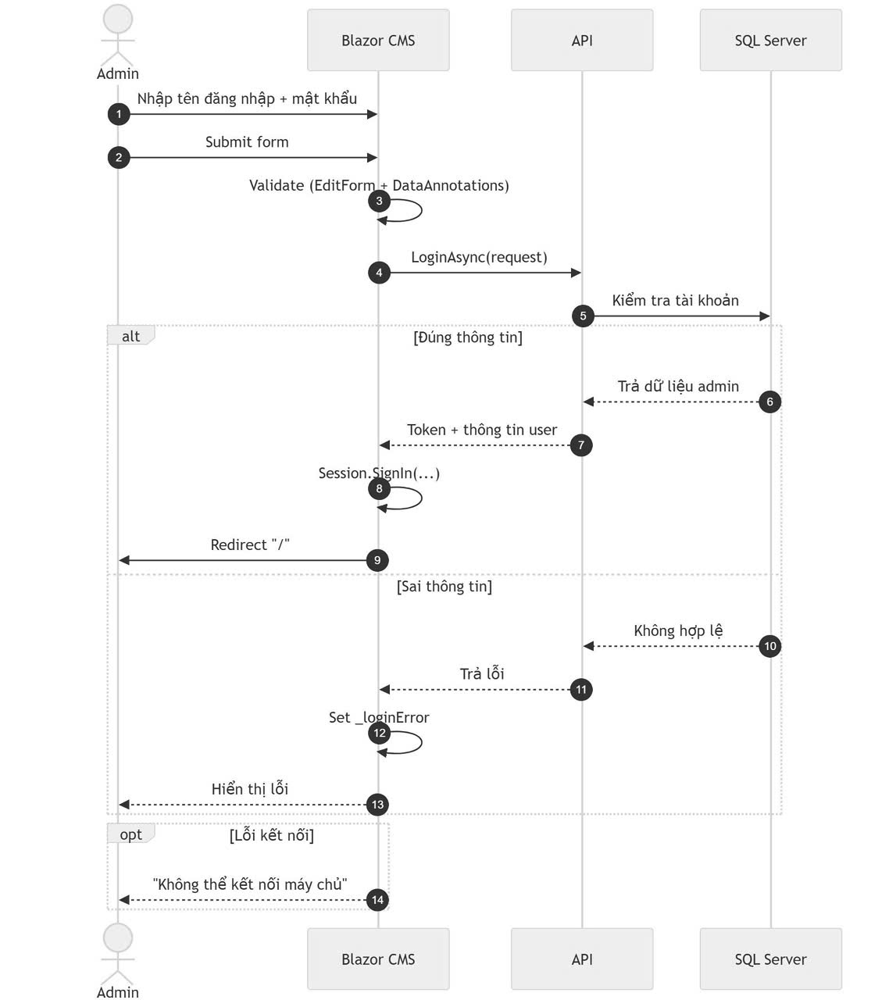
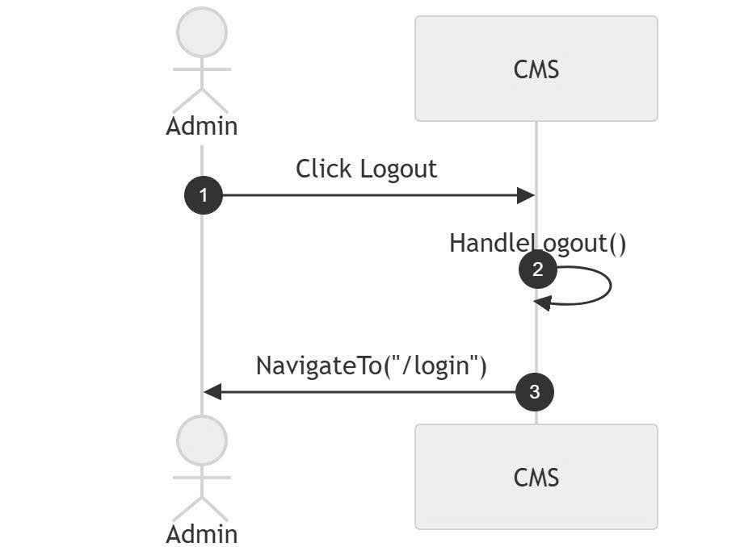
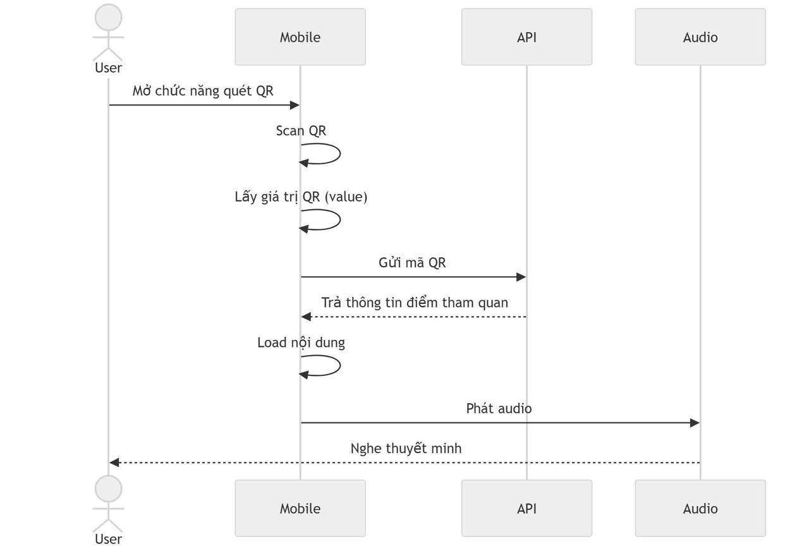
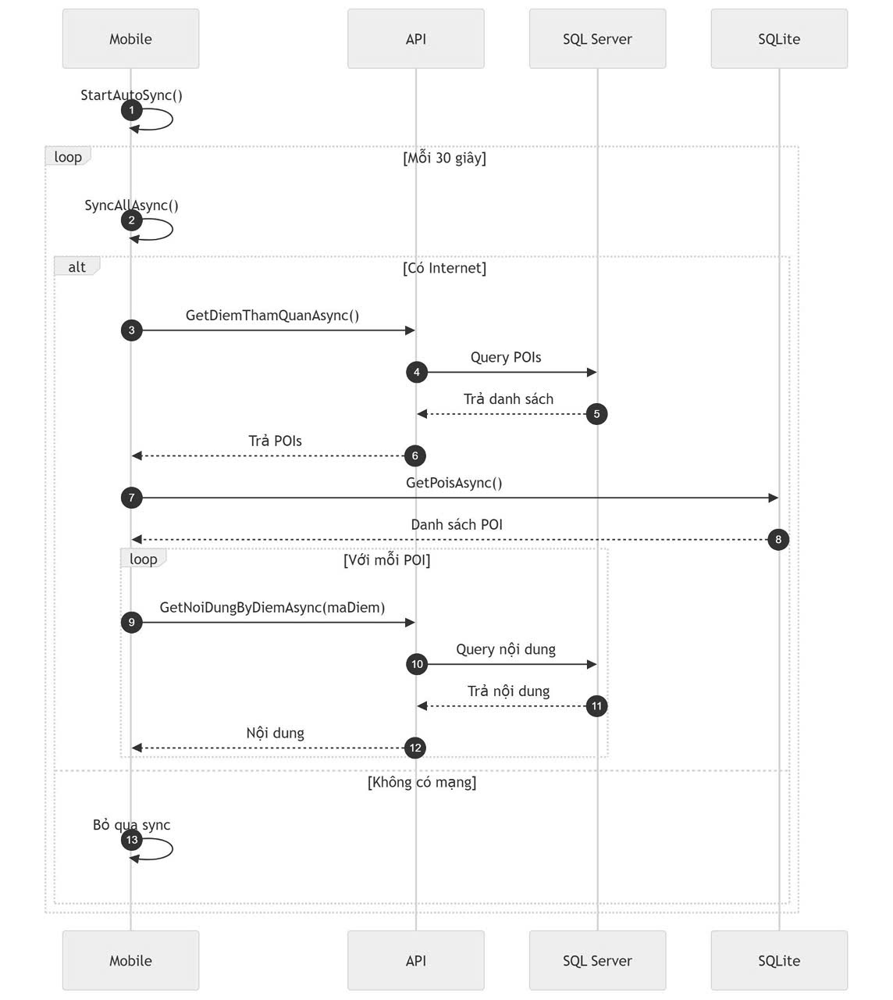
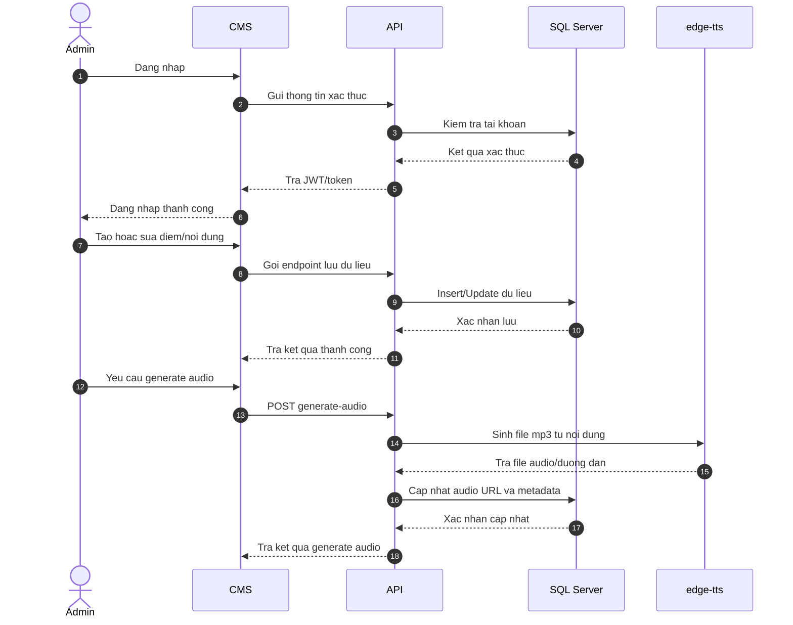
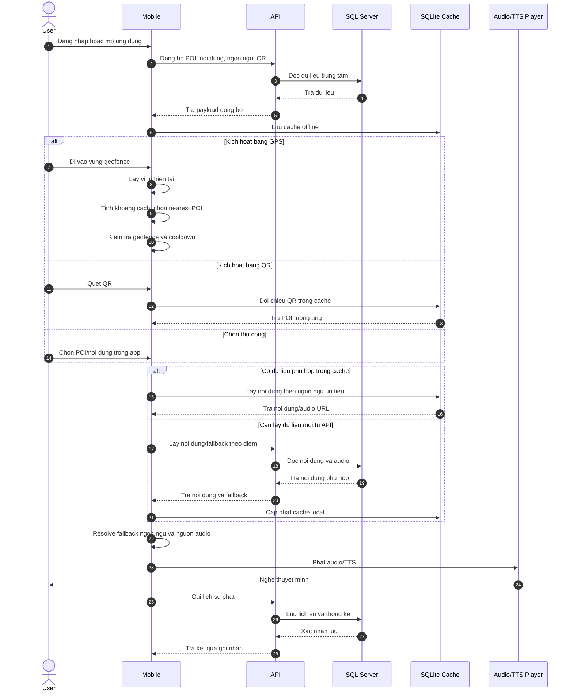
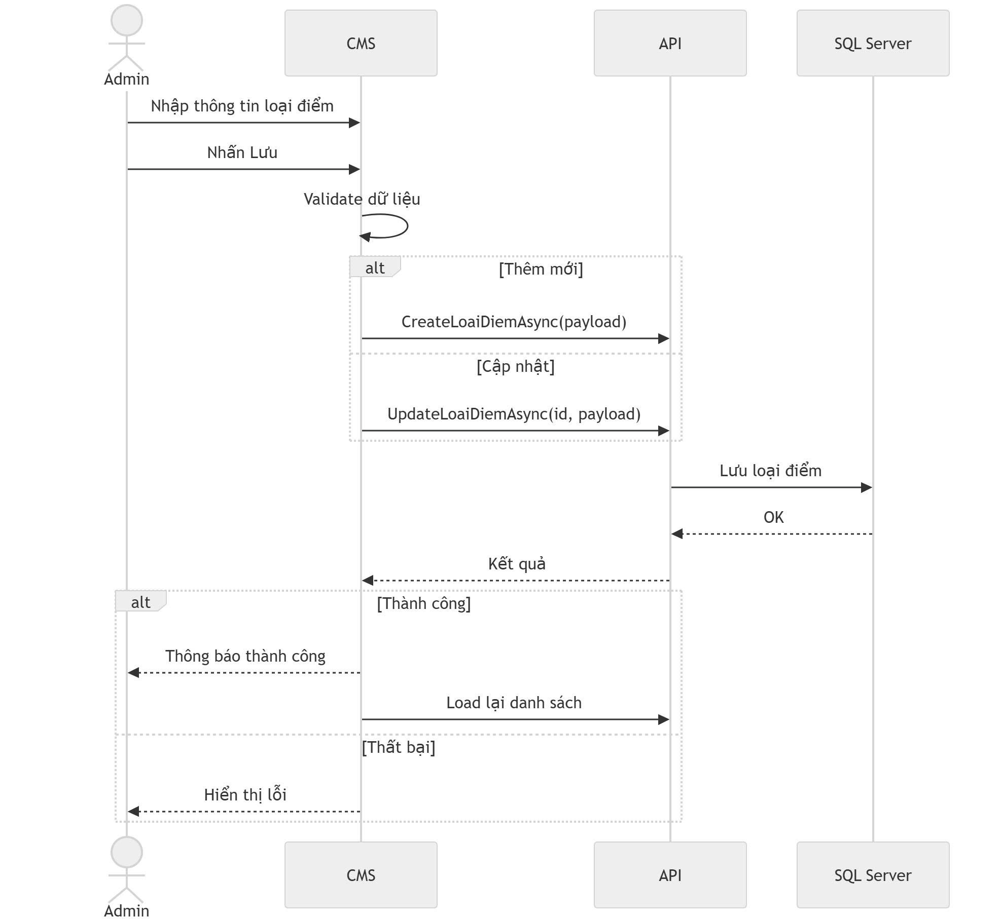
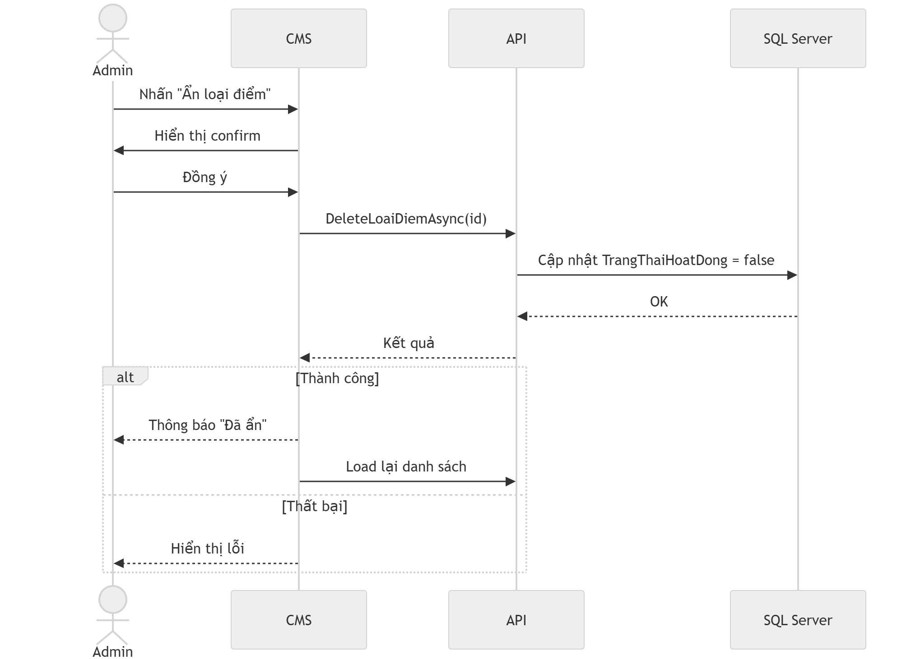
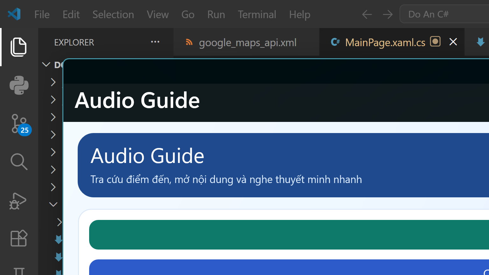
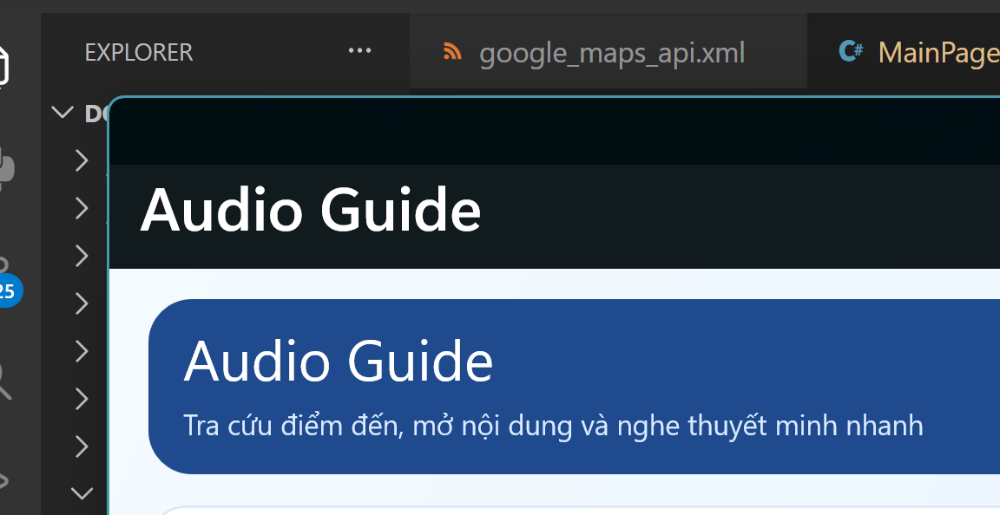

# PRD - Hệ thống thuyết minh du lịch bằng GPS

## 1. Thông tin chung

- Tên đề tài: Hệ thống thuyết minh du lịch bằng GPS
- Phiên bản tài liệu: v1.5
- Ngày cập nhật: 13/04/2026
- Trạng thái: MVP đã có API, CMS, Mobile, offline SQLite, GPS/QR trigger, đa ngôn ngữ và TTS local

## 2. Tóm tắt sản phẩm

Hệ thống cho phép khách du lịch sử dụng ứng dụng mobile để nhận nội dung thuyết minh tại điểm tham quan. Nội dung có thể được kích hoạt tự động theo GPS, quét QR hoặc chọn thủ công trong ứng dụng. Toàn bộ dữ liệu trung tâm được quản lý qua CMS và API, trong khi mobile hỗ trợ cache offline để vẫn sử dụng được khi mất kết nối.

Sản phẩm gồm 3 module chính:
- Mobile app cho người dùng cuối, xây dựng bằng .NET MAUI
- Web API cho xử lý nghiệp vụ và dữ liệu trung tâm, xây dựng bằng ASP.NET Core
- CMS cho quản trị viên, xây dựng bằng Blazor Server

## 3. Mục tiêu đề tài

- Tự động hóa trải nghiệm nghe thuyết minh tại điểm tham quan
- Giảm phụ thuộc vào hướng dẫn viên tại chỗ
- Hỗ trợ đồng bộ dữ liệu tập trung và vận hành được trong điều kiện mất mạng
- Cho phép quản trị viên cập nhật nội dung, QR, hình ảnh và audio từ một hệ thống chung
- Hỗ trợ đa ngôn ngữ ở cả giao diện mobile và nội dung thuyết minh

## 4. Phạm vi chức năng hiện tại

### 4.1 Mobile

- Đăng nhập, đăng ký người dùng
- Đồng bộ danh sách điểm tham quan, nội dung, ngôn ngữ và mã QR từ API
- Cache dữ liệu xuống SQLite để sử dụng offline
- Kích hoạt nội dung bằng 3 cách: GPS, QR và chọn thủ công
- Phát audio từ file có sẵn nếu CMS/API đã sinh trước
- Fallback sang nội dung/ngôn ngữ khả dụng khi không có đúng ngôn ngữ ưu tiên
- Hỗ trợ chọn ngôn ngữ giao diện: `vi`, `en`, `zh-CN`
- Hỗ trợ route test GPS/poi sweep để demo và kiểm thử geofence
- Gửi lịch sử phát về API khi có kết nối

### 4.2 API

- Xác thực admin và người dùng bằng JWT
- Quản lý các danh mục chính:
	- Loại điểm tham quan
	- Điểm tham quan
	- Nội dung thuyết minh
	- Ngôn ngữ
	- Người dùng
	- Tài khoản
	- Mã QR
	- Hình ảnh điểm tham quan
	- Lịch sử phát
- Cung cấp endpoint lấy nội dung theo điểm, theo ngôn ngữ và fallback nội dung
- Sinh audio thuyết minh local bằng `edge-tts`
- Lưu và phục vụ đường dẫn audio cho mobile
- Tổng hợp dữ liệu thống kê lượt nghe theo điểm và theo kiểu kích hoạt

### 4.3 CMS

- Đăng nhập hệ thống quản trị
- Quản lý loại điểm và điểm tham quan
- Quản lý nội dung thuyết minh theo ngôn ngữ
- Quản lý mã QR, tài khoản, người dùng, ngôn ngữ
- Theo dõi thống kê lượt nghe
- Gọi API để thêm, sửa, xóa và sinh lại audio cho nội dung

## 5. Đối tượng sử dụng

- Quản trị viên:
	- Quản lý dữ liệu điểm tham quan và nội dung thuyết minh
	- Sinh audio TTS và theo dõi tình trạng vận hành
- Người dùng cuối:
	- Đăng nhập hoặc đăng ký trên mobile
	- Di chuyển đến điểm tham quan để nghe thuyết minh
	- Quét QR hoặc chọn điểm để nghe nội dung thủ công

## 6. Luồng nghiệp vụ chính

### 6.1 Luồng quản trị nội dung

1. Quản trị viên đăng nhập CMS.
2. Tạo hoặc cập nhật điểm tham quan.
3. Thêm nội dung thuyết minh theo ngôn ngữ.
4. Sinh audio bằng `edge-tts` nếu cần.
5. Cập nhật QR, hình ảnh và các thông tin liên quan.
6. Dữ liệu được lưu tại SQL Server và phục vụ qua API.

Hình minh họa luồng đăng nhập CMS:



Hình minh họa luồng đăng xuất CMS:



### 6.2 Luồng sử dụng trên mobile

1. Người dùng đăng nhập hoặc đăng ký trên mobile.
2. Ứng dụng đồng bộ dữ liệu từ API và lưu vào SQLite local.
3. Khi người dùng đến gần điểm tham quan, app kiểm tra vị trí và bán kính kích hoạt.
4. Nếu đúng điều kiện, app lấy nội dung phù hợp theo ngôn ngữ ưu tiên.
5. Nếu không có đúng ngôn ngữ, hệ thống fallback sang nội dung khả dụng.
6. App phát audio có sẵn hoặc audio TTS đã được sinh trước.
7. Ứng dụng gửi lịch sử phát về API để tổng hợp thống kê.

Hình minh họa kích hoạt theo GPS/geofence:


### 6.3 Luồng QR

1. Người dùng mở màn quét QR.
2. App đọc giá trị QR và đối chiếu với dữ liệu đã đồng bộ.
3. Tìm điểm tham quan tương ứng.
4. Lấy nội dung theo ngôn ngữ ưu tiên và phát audio.

Hình minh họa luồng quét QR:



## 7. Yêu cầu chức năng chi tiết

### 7.1 Đồng bộ và offline

- Mobile phải đọc được dữ liệu điểm tham quan và nội dung khi mất mạng.
- Dữ liệu được cache trong SQLite trên thiết bị.
- Khi có mạng trở lại, mobile ưu tiên đồng bộ lại dữ liệu mới nhất từ API.
- Audio có thể phát từ đường dẫn HTTP hoặc tệp nội bộ đã cache/sinh trước.

Hình minh họa luồng đồng bộ và offline cache:



### 7.2 GPS và geofence

- Hệ thống xác định vị trí người dùng từ GPS trên thiết bị.
- Kiểm tra khoảng cách đến các điểm tham quan gần đây.
- Kích hoạt nội dung khi nằm trong bán kính của điểm.
- Không phát lặp lại liên tục khi người dùng vẫn đang ở trong cùng một vùng.
- Hỗ trợ route test để demo logic GPS mà không cần di chuyển thực tế.

### 7.3 Đa ngôn ngữ và fallback

- Mobile phải cho phép chọn ngôn ngữ giao diện.
- Nội dung thuyết minh được ưu tiên theo ngôn ngữ người dùng chọn.
- Nếu điểm tham quan không có nội dung đúng ngôn ngữ, hệ thống phải fallback sang ngôn ngữ khả dụng.
- Thông tin về ngôn ngữ đang phát cần được hiển thị rõ trên mobile.

### 7.4 Audio và TTS

- Nội dung có thể sử dụng file audio có sẵn hoặc audio sinh bằng `edge-tts`.
- API cung cấp chức năng sinh audio cho từng nội dung hoặc theo yêu cầu.
- Mobile ưu tiên phát đường dẫn audio hợp lệ nếu API/CMS đã sinh file trước.
- Hệ thống phải xử lý được trường hợp đường dẫn audio là URL HTTP hoặc tệp local.

### 7.5 Thống kê và lịch sử

- Mỗi lần phát nội dung cần có khả năng ghi nhận lịch sử.
- API tổng hợp thống kê lượt nghe theo điểm và theo kiểu kích hoạt.
- CMS hiển thị thống kê để quản trị viên theo dõi mức độ sử dụng.

## 8. Yêu cầu phi chức năng

- Kiến trúc dữ liệu chuẩn: `SQL Server -> API -> Mobile SQLite cache`
- CMS và API phải hoạt động được trong môi trường local để demo đồ án
- Ứng dụng mobile ưu tiên trải nghiệm offline-first
- Tài khoản và phiên đăng nhập được quản lý có xác thực
- Tài liệu và mã nguồn phải dễ bàn giao để thành viên mới clone về có thể chạy được

## 9. Thành phần dữ liệu chính

Hệ thống đang xoay quanh các nhóm đối tượng sau:
- `LoaiDiemThamQuan`
- `DiemThamQuan`
- `NoiDungThuyetMinh`
- `NgonNgu`
- `MaQr`
- `HinhAnhDiemThamQuan`
- `LichSuPhat`
- `NguoiDung`
- `TaiKhoan`

SQL Server là nguồn dữ liệu trung tâm. SQLite trên mobile chỉ đóng vai trò cache offline và lưu dữ liệu đồng bộ để phục vụ người dùng cuối.

## 10. API chính đang có trong source

### 10.1 Xác thực

- `POST /api/auth/admin/login`
- `POST /api/auth/user/login`
- `POST /api/auth/user/register`

### 10.2 Danh mục và điểm tham quan

- `GET/POST/PUT/DELETE /api/LoaiDiemThamQuan`
- `GET/POST/PUT/DELETE /api/DiemThamQuan`
- `GET /api/DiemThamQuan/gan-day`

### 10.3 Nội dung và audio

- `GET /api/NoiDungThuyetMinh/diem/{maDiem}`
- `GET /api/NoiDungThuyetMinh/diem/{maDiem}/ngonngu/{maNgonNgu}`
- `POST /api/NoiDungThuyetMinh/{id}/generate-audio`
- `POST /api/NoiDungThuyetMinh/generate-audio`
- `GET /api/noidung/{maDiem}`
- `GET /api/noidung/{maDiem}/fallback?maNgonNguUuTien={id}`

### 10.4 Đối tượng hỗ trợ khác

- `GET/POST/PUT/DELETE /api/NgonNgu`
- `GET/POST/PUT/DELETE /api/NguoiDung`
- `GET/POST/PUT/DELETE /api/TaiKhoan`
- `GET/POST/PUT/DELETE /api/MaQr`
- `GET /api/MaQr/gia-tri/{giaTriQr}`
- `GET /api/HinhAnhDiemThamQuan/diem/{maDiem}`
- `POST /api/HinhAnhDiemThamQuan/upload`
- `GET/POST/PUT/DELETE /api/LichSuPhat`
- `GET /api/LichSuPhat/thong-ke/luot-nghe-theo-diem`
- `GET /api/LichSuPhat/thong-ke/luot-nghe-theo-kich-hoat`

## 11. Công nghệ sử dụng

- Mobile: .NET MAUI
- API: ASP.NET Core
- CMS: Blazor Server
- Cơ sở dữ liệu trung tâm: SQL Server
- Cache offline mobile: SQLite
- Xác thực: JWT
- Audio TTS: `edge-tts`

## 12. Tiêu chí nghiệm thu MVP hiện tại

- Quản trị viên đăng nhập CMS và quản lý được dữ liệu cơ bản
- Tạo/sửa được nội dung thuyết minh theo ngôn ngữ
- Sinh được audio TTS từ nội dung
- Mobile đăng nhập, đồng bộ và đọc dữ liệu offline được
- Mobile kích hoạt nội dung bằng GPS hoặc QR được
- Mobile phát được audio và có fallback ngôn ngữ/nội dung
- API ghi nhận được lịch sử phát và CMS xem được thống kê cơ bản

## 13. Giới hạn và hướng phát triển tiếp

### 13.1 Giới hạn hiện tại

- Hệ thống hiện tại tập trung vào MVP và demo đồ án, chưa có CI/CD hoàn chỉnh
- Kiểm thử tự động chưa đầy đủ
- TTS đang phụ thuộc vào môi trường có cài đặt `edge-tts`

### 13.2 Hướng phát triển tiếp

- Bổ sung checklist smoke test và tài liệu vận hành chi tiết hơn
- Mở rộng kiểm thử tự động cho API, CMS và mobile
- Hoàn thiện bộ tài liệu onboarding cho thành viên mới
- Tối ưu thêm trải nghiệm bản đồ, định tuyến và quản lý media

## 15. Thuật toán và logic

### 15.1 Haversine

Hệ thống sử dụng công thức Haversine để tính khoảng cách giữa vị trí hiện tại của người dùng và tọa độ điểm tham quan.

Công thức tổng quát:

$$
d = 2R \cdot \arcsin\left(\sqrt{\sin^2\left(\frac{\Delta \varphi}{2}\right) + \cos(\varphi_1)\cos(\varphi_2)\sin^2\left(\frac{\Delta \lambda}{2}\right)}\right)
$$

Trong đó:
- $R$ là bán kính Trái Đất
- $\varphi$ là vĩ độ
- $\lambda$ là kinh độ

Mục đích:
- Xác định điểm tham quan nào đang ở gần người dùng nhất
- Hỗ trợ logic geofence để kích hoạt nội dung đúng vị trí

### 15.2 Geofence

Mỗi điểm tham quan có bán kính kích hoạt riêng. Sau khi tính khoảng cách, hệ thống so sánh với bán kính của điểm:

- Nếu `distance <= triggerRadius` thì điểm đủ điều kiện kích hoạt
- Nếu người dùng đã từng được kích hoạt gần đây, hệ thống áp dụng cooldown để tránh phát lặp tức liên tiếp
- Nếu người dùng ra khỏi vùng kích hoạt, state của điểm sẽ được đặt lại để lần sau có thể phát lại

### 15.3 Nearest POI

Khi có nhiều điểm tham quan ở gần nhau, mobile ưu tiên chọn điểm gần nhất hoặc điểm phù hợp nhất theo điều kiện:

- Lọc các điểm đang nằm trong tầm đồng bộ/quan sát
- Tính khoảng cách đến từng điểm
- Sắp xếp theo khoảng cách tăng dần
- Chọn điểm gần nhất và đủ điều kiện geofence để xử lý tiếp

Logic này được dùng cho:
- Hiện điểm gần nhất trên mobile
- Tự động kích hoạt nội dung khi demo GPS
- Giảm trường hợp phát sai điểm khi các POI nằm gần nhau

### 15.4 State flag

Để tránh phát nội dung lặp lại không cần thiết, mobile duy trì các cờ trạng thái trong quá trình chạy:

- Đánh dấu điểm vừa được auto-trigger
- Lưu mốc thời gian kích hoạt gần nhất theo từng POI
- Theo dõi trạng thái fallback ngôn ngữ đang được áp dụng
- Theo dõi route GPS test và các điểm đã trigger trong phiên demo

State flag giúp:
- Hạn chế spam audio
- Tránh gửi lịch sử lặp lại quá nhiều
- Giúp luồng GPS/QR/manual hoạt động nhất quán

## 16. Flow và sequence

### 16.1 Flow nghiệp vụ tổng quát

```text
Admin dang nhap CMS
-> Tao/Sua diem tham quan va noi dung
-> API luu du lieu vao SQL Server
-> Mobile dang nhap va dong bo du lieu
-> Nguoi dung di chuyen hoac quet QR
-> He thong tim diem phu hop
-> Lay noi dung theo ngon ngu uu tien
-> Fallback neu can
-> Phat audio
-> Gui lich su phat ve API
-> CMS xem thong ke
```

### 16.2 Flow GPS trên mobile

```text
Start
-> Xin quyen GPS
-> Lay vi tri hien tai
-> Tinh khoang cach den danh sach diem
-> Tim nearest POI
-> Kiem tra geofence + cooldown
-> Lay noi dung theo ngon ngu duoc chon
-> Fallback neu khong co noi dung phu hop
-> Resolve audio URL/local file
-> Phat audio
-> Ghi lich su phat
```

### 16.3 Sequence diagram quản trị nội dung



Hình minh họa test thực tế cho luồng CMS đăng nhập:


### 16.4 Sequence diagram mobile GPS/QR



Hình minh họa test thực tế cho GPS trigger:


Hình minh họa test thực tế cho QR trigger:


## 17. Test case

Bảng test tóm tắt cho MVP hiện tại:

| ID | Nhóm test | Tình huống | Kết quả mong đợi |
| --- | --- | --- | --- |
| TC-MVP-01 | CMS Auth | Admin đăng nhập đúng tài khoản hợp lệ | Đăng nhập thành công và vào được trang quản trị |
| TC-MVP-02 | CMS Nội dung | Tạo mới nội dung thuyết minh theo ngôn ngữ | Lưu thành công, hiện lại đúng trong danh sách |
| TC-MVP-03 | CMS Audio | Generate audio cho nội dung | API sinh file mp3 và cập nhật đường dẫn audio |
| TC-MVP-04 | API | Lấy nội dung theo điểm tham quan | Trả đúng danh sách nội dung theo điểm |
| TC-MVP-05 | API Fallback | Gọi endpoint fallback với ngôn ngữ ưu tiên không tồn tại | Trả nội dung fallback khả dụng, không lỗi |
| TC-MVP-06 | Mobile Sync | Mobile đồng bộ dữ liệu khi có mạng | Danh sách điểm, nội dung, ngôn ngữ và QR được lưu vào SQLite |
| TC-MVP-07 | Mobile Offline | Tắt mạng sau khi đã đồng bộ | Mobile vẫn đọc được dữ liệu và phát nội dung từ cache |
| TC-MVP-08 | GPS Trigger | Người dùng đi vào bán kính kích hoạt | Nội dung tự động được chọn và phát audio |
| TC-MVP-09 | QR Trigger | Người dùng quét QR hợp lệ | Mở đúng điểm tham quan và phát nội dung tương ứng |
| TC-MVP-10 | Language | Chọn ngôn ngữ `en` hoặc `zh-CN` | Giao diện và nội dung ưu tiên theo ngôn ngữ đã chọn |
| TC-MVP-11 | Audio Source | Nội dung có sẵn file audio | Mobile ưu tiên phát audio đã sinh sẵn |
| TC-MVP-12 | Logging | Phát nội dung thành công | API ghi nhận lịch sử phát và CMS xem được thống kê cơ bản |

Tài liệu test chi tiết cho phần CMS admin được mở rộng thêm trong `docs/TestCase.md`.

### 17.1 Số liệu test thực tế

Bảng dưới đây tổng hợp các thông số đã được đối chiếu từ source và môi trường demo hiện tại:

| Hạng mục | Giá trị thực tế | Nguồn đối chiếu |
| --- | --- | --- |
| Build API local | `dotnet build` thành công, exit code `0` | Terminal build ngày 12/04/2026 |
| Cổng API demo | `http://localhost:5000` | `Run-DoAn.ps1` |
| Cổng CMS demo | `http://localhost:5256` hoặc cổng fallback trong khoảng `5257-5275` | `Run-DoAn.ps1` |
| Số ngôn ngữ giao diện mobile đang hỗ trợ | `3` ngôn ngữ: `vi`, `en`, `zh-CN` | `LanguageService.cs` |
| Chu kỳ refresh GPS | `5` giây | `MainPage.xaml.cs` |
| Chu kỳ GPS test step | `6` giây | `MainPage.xaml.cs` |
| Cooldown geofence | `2` phút | `MainPage.xaml.cs` |
| Bán kính kích hoạt tối thiểu hữu hiệu | `45` mét | `MainPage.xaml.cs` |
| Bán kính POI mặc định | `0.6` km | `MainPage.xaml.cs` |
| Bán kính người dùng mặc định | `1` km | `MainPage.xaml.cs` |
| Tệp route GPS test | `vinh-khanh-food-tour.gpx` | `MainPage.xaml.cs` |

Nhận xét từ đợt test nội bộ:
- Luồng demo hiện tại đã có đủ dữ liệu để kiểm thử GPS, QR, offline cache và đa ngôn ngữ.
- Phần test mobile ưu tiên xác nhận được logic geofence, fallback ngôn ngữ và phát audio từ nguồn đã sinh sẵn.
- Hệ thống phù hợp để trình bày theo kiểu demo local, chưa đạt mức deployment production.

## 18. Edge case

Cần lưu ý các trường hợp biên sau:

- GPS dao động làm người dùng đứng sát biên geofence, dễ gây trigger lặp lại
- Nhiều điểm tham quan nằm gần nhau, khó chọn đúng nearest POI
- Ngôn ngữ người dùng chọn không có nội dung tương ứng cho điểm hiện tại
- Audio URL trả về dạng `file://` hoặc `localhost` khi chạy trên Android emulator
- Mobile đang offline trong lúc người dùng chưa kịp đồng bộ dữ liệu mới nhất
- QR không hợp lệ hoặc QR không tồn tại trong cache
- File audio đã được tạo nhưng rỗng hoặc không phát được
- Token hết hạn trong quá trình đang sử dụng mobile hoặc CMS
- API mất kết nối trong lúc đang đồng bộ hoặc gửi lịch sử phát
- Quyền GPS bị từ chối hoặc thiết bị không hỗ trợ map/GPS đầy đủ

Hướng xử lý mong muốn:
- Có fallback sang cache local nếu online thất bại
- Có thông báo lỗi thân thiện cho người dùng
- Không crash app khi GPS, audio hoặc API gặp lỗi

## 19. UI và wireframe mô tả

### 19.1 Mobile

Màn hình chính mobile hiện tại gồm các khối chức năng:
- Thanh tiêu đề và các hành động đăng xuất/đồng bộ
- Khu vực map hoặc trạng thái GPS
- Bộ chọn ngôn ngữ hiển thị/nội dung
- Danh sách điểm tham quan
- Danh sách nội dung của điểm đang chọn
- Khu vực GPS test log để demo route kích hoạt

Wireframe mô tả:

```text
+--------------------------------------------------+
| He thong thuyet minh du lich                     |
| [Sync] [Logout]                                 |
+--------------------------------------------------+
| GPS status / Map view                            |
| Nearest POI / Current location                   |
+--------------------------------------------------+
| Language: [vi | en | zh-CN]                      |
| Display language: [dropdown]                     |
+--------------------------------------------------+
| Danh sach diem tham quan                         |
| - POI A                                          |
| - POI B                                          |
| - POI C                                          |
+--------------------------------------------------+
| Noi dung thuyet minh cua diem dang chon          |
| [Play] [Stop]                                    |
| Tieu de / mo ta / fallback status                |
+--------------------------------------------------+
| GPS test log / route demo                        |
+--------------------------------------------------+
```

### 19.2 CMS

Wireframe mô tả cho CMS admin:

```text
+--------------------------------------------------+
| Sidebar                                          |
| - Dashboard                                      |
| - Loai diem                                      |
| - Diem tham quan                                 |
| - Noi dung thuyet minh                           |
| - QR                                             |
| - Ngon ngu                                       |
| - Tai khoan / Nguoi dung                         |
+--------------------------------------------------+
| Header + user session                            |
+--------------------------------------------------+
| Bang du lieu / form tao sua                      |
| Nut Luu / Xoa / Generate audio                   |
+--------------------------------------------------+
```

Ảnh minh họa thao tác thêm/sửa loại điểm trên CMS:



Ảnh minh họa thao tác ẩn loại điểm trên CMS:



### 19.3 Ghi chú UI

- Mobile ưu tiên rõ trạng thái GPS, ngôn ngữ đang chọn và nội dung đang phát
- CMS ưu tiên luồng CRUD nhanh, dễ thao tác khi demo đồ án
- Wireframe trong PRD là mô tả logic giao diện, không phải mockup pixel-perfect

### 19.4 Hình ảnh minh họa test thực tế

Ảnh chụp màn hình dưới đây là tài sản test/demo đã lưu trong `docs/assets/`.

Lưu ý:
- PRD này chỉ gắn ảnh tổng quan, sequence và màn hình test ở thư mục `docs/assets/`.
- Không sử dụng bộ ảnh trong `docs/assets/qr/` để tránh làm PRD bị dài và lặp lại dữ liệu mã QR.

Hình 1 - Màn hình mobile khi test giao diện Audio Guide:

[Xem file gốc: submission-mainpage.png](./assets/submission-mainpage.png)



Hình 2 - Ảnh crop tập trung vào phần header và thẻ chức năng chính:

[Xem file gốc: submission-mainpage-cropped.png](./assets/submission-mainpage-cropped.png)



Ý nghĩa minh họa:
- Xác nhận giao diện mobile đã được render thực tế trong quá trình test
- Cho thấy màn hình chính đang có tiêu đề, thẻ thông tin và bố cục phục vụ demo
- Có thể dùng trực tiếp trong báo cáo, slide hoặc lúc bảo vệ đồ án

Hình 3 - Sequence đăng nhập CMS:

[Xem file gốc: login.jpg](./assets/login.jpg)


Hình 4 - Sequence đăng xuất CMS:

[Xem file gốc: logout.jpg](./assets/logout.jpg)


Hình 5 - Sequence mobile GPS trigger:

[Xem file gốc: gps trigger.jpg](./assets/gps%20trigger.jpg)


Hình 6 - Sequence mobile QR trigger:

[Xem file gốc: hinhqr.jpg](./assets/hinhqr.jpg)


Hình 7 - Sequence mobile sync/offline:

[Xem file gốc: sync.jpg](./assets/sync.jpg)


Hình 8 - Sequence thêm/sửa loại điểm trên CMS:

[Xem file gốc: thêm sửa loại điểm.jpg](./assets/thêm sửa loại điểm.jpg)


Hình 9 - Sequence ẩn loại điểm trên CMS:

[Xem file gốc: ẩn loại điểm.jpg](./assets/ẩn loại điểm.jpg)


## 20. KPI

Để đánh giá mức độ đạt được của MVP, bộ KPI đề xuất cho đồ án gồm:

| Nhóm KPI | Chỉ số | Mục tiêu hiện tại |
| --- | --- | --- |
| Đồng bộ dữ liệu | Tỷ lệ sync thành công khi có mạng | >= 95% trong môi trường demo |
| Offline | Mobile đọc được nội dung đã cache khi mất mạng | 100% với dữ liệu đã đồng bộ |
| GPS Trigger | Tỷ lệ kích hoạt đúng điểm trong route demo | >= 90% |
| QR Trigger | Tỷ lệ quét QR hợp lệ và mở đúng điểm | >= 95% |
| Audio | Tỷ lệ phát được audio khi có file hợp lệ | >= 95% |
| Fallback ngôn ngữ | Tỷ lệ trả được nội dung thay thế khi thiếu ngôn ngữ ưu tiên | 100% nếu có nội dung khả dụng |
| CMS | Tạo/sửa nội dung và generate audio thành công | >= 95% trên dữ liệu demo |
| Thống kê | Lịch sử phát được ghi nhận và hiển thị trên CMS | >= 95% |

Ý nghĩa:
- KPI dùng để bảo vệ tính khả thi của MVP
- Không phải SLA production, mà là mức đánh giá trong bối cảnh đồ án và demo

## 21. Security

Hệ thống hiện tại áp dụng các nguyên tắc bảo mật cơ bản phù hợp với phạm vi MVP:

- API sử dụng JWT cho xác thực admin và người dùng
- Các thao tác quản trị dữ liệu đi qua CMS và API thay vì truy cập trực tiếp DB
- API có `Authentication` và `Authorization` trong cấu hình khởi động
- Không sử dụng SQLite làm nguồn dữ liệu trung tâm trong luồng vận hành chuẩn
- Mobile chỉ lưu cache offline phục vụ truy cập nội dung, không thay thế hệ thống trung tâm
- Hệ thống cần xin quyền GPS trên thiết bị và chỉ sử dụng vị trí cho luồng kích hoạt nội dung

Rủi ro và lưu ý hiện tại:
- JWT key và cấu hình vận hành cần được quản lý bằng file cấu hình/phiên bản triển khai phù hợp, không để lộ trong môi trường công khai
- TTS phụ thuộc vào công cụ `edge-tts` cài trên máy chạy API
- Cần tiếp tục rà soát validate input, phân quyền endpoint và log audit nếu mở rộng hệ thống

## 22. Error handling

Hệ thống hiện tại ưu tiên xử lý lỗi theo hướng thân thiện với người dùng và fallback khi có thể:

### 22.1 Trên mobile

- Nếu gọi API thất bại khi có mạng, mobile sẽ ưu tiên đọc dữ liệu đã cache trong SQLite
- Nếu audio URL không hợp lệ, mobile có cơ chế resolve lại từ base URL phù hợp
- Nếu ngôn ngữ ưu tiên không có nội dung, mobile gọi fallback và dùng ngôn ngữ khả dụng
- Nếu đồng bộ thất bại do mất mạng, app không được crash và sẽ thử đồng bộ lại khi có kết nối

### 22.2 Trên API và CMS

- API trả response JSON và bỏ qua trường null để payload gọn hơn
- CMS và mobile cần hiện thông báo lỗi dễ hiểu khi login, đồng bộ, generate audio hoặc lưu dữ liệu thất bại
- Script `Run-DoAn.ps1` có xử lý build lại, retry và thông báo log khi API/CMS khởi động thất bại

Mục tiêu xử lý lỗi:
- Không crash hệ thống trong các tình huống lỗi phổ biến
- Có thông báo rõ nghĩa để người dùng và nhóm demo xử lý nhanh
- Ưu tiên fallback thay vì dừng hệ thống hoàn toàn

## 23. API response sample

Dưới đây là một số mẫu response đại diện để đưa vào PRD và thuyết trình.

### 23.1 Login người dùng thành công

```json
{
	"token": "eyJhbGciOiJIUzI1NiIsInR5cCI6IkpXVCJ9...",
	"taiKhoan": {
		"maTaiKhoan": 12,
		"tenDangNhap": "user01",
		"vaiTro": "User"
	}
}
```

### 23.2 Lấy danh sách điểm tham quan

```json
[
	{
		"maDiem": 1,
		"tenDiem": "Pho am thuc Vinh Khanh",
		"viDo": 10.7552,
		"kinhDo": 106.7018,
		"banKinhKichHoat": 60,
		"ngayCapNhat": "2026-04-12T10:00:00"
	}
]
```

### 23.3 Fallback nội dung theo ngôn ngữ

```json
{
	"maDiem": 1,
	"maNgonNguYeuCau": 3,
	"maNgonNguDaDung": 1,
	"coFallback": true,
	"noiDung": {
		"maNoiDung": 15,
		"tieuDe": "Gioi thieu diem tham quan",
		"moTa": "Noi dung thuyet minh bang tieng Viet",
		"duongDanAmThanh": "/audio/tts/noidung-15.mp3"
	}
	}
```

### 23.4 Ghi nhận lịch sử phát

```json
{
	"thanhCong": true,
	"thongDiep": "Da luu lich su phat",
	"duLieu": {
		"maLichSu": 101,
		"maDiem": 1,
		"kieuKichHoat": "gps"
	}
}
```

Lưu ý:
- Mẫu response trong PRD mang tính mô tả nghiệp vụ và cấu trúc payload
- Payload thực tế có thể thêm bớt một số trường tùy theo DTO đang sử dụng trong source

## 24. Deployment

### 24.1 Môi trường demo hiện tại

- API chạy local qua `dotnet` trên cổng `5000`
- CMS chạy local qua `dotnet` trên cổng `5256` hoặc cổng trong khoảng fallback nếu bị trùng
- Mobile kết nối đến API local khi test trên Windows hoặc Android emulator
- SQL Server là nguồn dữ liệu chuẩn cho chế độ online
- SQLite được dùng cho mobile cache và có thể dùng SQLite mode trong API để dev/test cục bộ

### 24.2 Cách chạy nhanh

Chế độ online:

```powershell
powershell -ExecutionPolicy Bypass -File .\Run-DoAn.ps1 -Mode online
```

Chế độ offline dev/test:

```powershell
powershell -ExecutionPolicy Bypass -File .\Run-DoAn.ps1 -Mode offline
```

Reset offline DB rồi chạy lại:

```powershell
powershell -ExecutionPolicy Bypass -File .\Run-DoAn.ps1 -Mode offline -ResetOfflineDb
```

### 24.3 Ghi chú triển khai

- Swagger được bật để test API nhanh trong môi trường local/demo
- `UseHttpsRedirection` chỉ áp dụng khi không ở môi trường Development
- Cần cấu hình đúng chuỗi kết nối SQL Server và JWT trước khi demo
- Nếu test Android emulator, cần đảm bảo mobile sử dụng đúng base URL như `10.0.2.2`
- Deployment hiện tại phù hợp cho demo đồ án và môi trường nội bộ, chưa hướng tới production scale

## 25. Kết luận

PRD này phản ánh hiện trạng thực tế của đồ án trên nhánh `main`: hệ thống đã có đầy đủ 3 module API, CMS và Mobile; hỗ trợ GPS, QR, offline SQLite, đa ngôn ngữ, fallback nội dung và generate audio bằng `edge-tts`. Tài liệu này được dùng làm mốc để tiếp tục hoàn thiện bộ docs và nghiệm thu sản phẩm.

